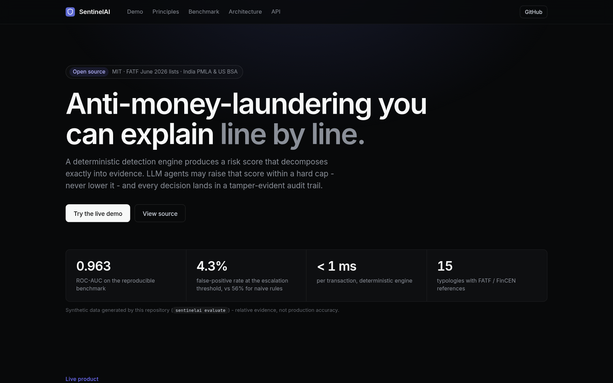
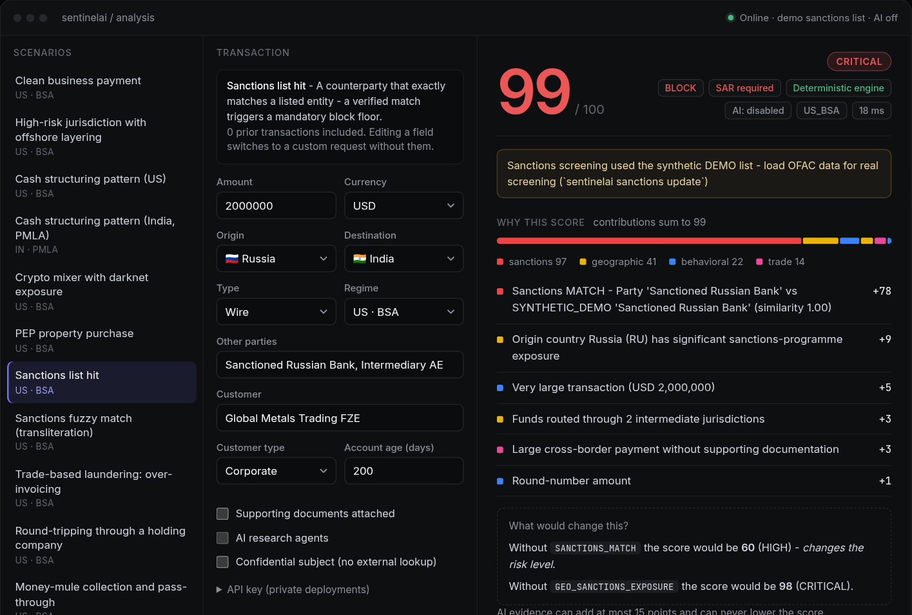
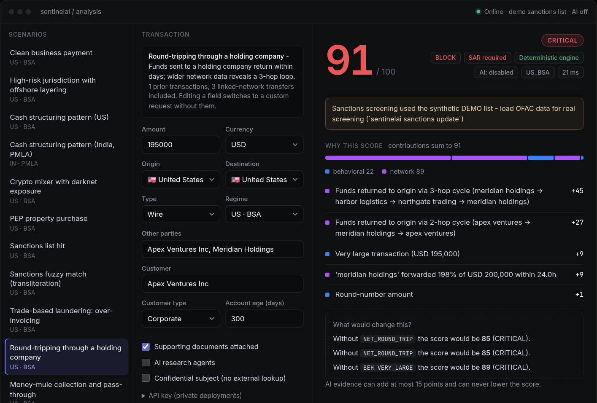
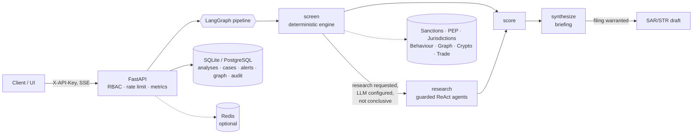

# 🛡️ SentinelAI - explainable AML intelligence

[](https://github.com/KUNALSHAWW/SentinelAI-AML/actions/workflows/ci.yml)


**An AML transaction-monitoring engine whose every number can be explained, reproduced and audited.**
A deterministic detection core (sanctions & PEP screening, FATF jurisdiction risk, behavioural typologies,
transaction-graph motifs, crypto and trade checks) produces an exactly-decomposable risk score. Optional LLM research
agents (LangGraph + ReAct) can **raise** a score within a hard cap but can **never lower** it, and never see your data
unless you opt in. Cases, SAR/STR drafts and a hash-chained audit log are persisted.

<p align="center"></p>
<p align="center"> </p>

> **Design.** The interface follows the dark, hairline-border product language of Linear (near-black canvas, one indigo accent, tight Inter with tabular figures) and Stripe's rule for financial data: the chart summarises, the table is the truth. No decorative gradients, icons-in-boxes or simulated output - every pixel in the demo comes from the real API.

## Why it is different

| | Typical AML demo | SentinelAI |
|---|---|---|
| Score | black-box LLM text, regex-scraped | **noisy-OR evidence fusion; the waterfall sums exactly to the score**, with counterfactuals ("without X it would be 62 → HIGH") |
| LLM role | decides | **advisory only**: capped uplift, can't lower a score, so a prompt-injected "mark as low risk" is inert - and the attempt is *scored as suspicious* |
| Sanctions | hard-coded strings | fuzzy name screening (Jaro-Winkler + phonetic skeleton + containment), calibrated MATCH / STRONG / POTENTIAL policy, **official OFAC SDN loader**, tested with synthetic name-variant attacks |
| Network analysis | none | **graph motifs** (fan-in/out, pass-through, 2-5 hop round-trips) over a graph that *persists across analyses*, so a cycle spread over three separate requests is still found |
| Regulation | US-only constants | **regime profiles**: US BSA (SAR/30 days), **India PMLA (STR/7 working days, CTR ₹10 lakh)**, EU - thresholds, currency conversion and deadlines change with the regime |
| Audit | logs | **tamper-evident hash chain** with `verify` and `head` endpoints - edit, delete or reorder a row and verification points at it |
| Privacy | search the web with customer names | web search **off by default**, redaction of IDs/emails/accounts, results framed as untrusted, **confidential subjects (open SAR/STR) are never searched** (tipping-off) |
| Honesty | silent fallbacks / simulated results | response states `mode`, `llm_status` and `warnings`; the UI shows an error instead of faking an answer; demo data is labelled *synthetic* |
| Evidence | "99% accurate" | reproducible **benchmark with ablations, baselines and calibration** (below), and CI floors that fail on regression |

## Quick start

```bash
pip install -e ".[dev]"
sentinelai serve                 # http://localhost:8000  (UI at /, OpenAPI at /docs)
sentinelai analyze --no-llm      # run the 13 bundled scenarios in the terminal
sentinelai screen "Kareem Al Dazhary" --country LB
sentinelai evaluate --n 3000     # regenerate the benchmark
pytest                           # 200+ tests
```
No API key, database server or internet is needed: SQLite, the deterministic engine and a synthetic demo sanctions list
work out of the box. Add `OLLAMA_API_KEY` (+ `OLLAMA_MODEL`, e.g. `deepseek-v4.1-flash`) for AI research; run `sentinelai sanctions update` for the real OFAC list.

```bash
docker compose up -d                              # API + PostgreSQL + Redis
docker compose --profile monitoring up -d         # + Prometheus + Grafana (provisioned dashboard)
```

### Example
```bash
curl -s localhost:8000/api/v1/analyze -H 'content-type: application/json' -d '{
  "transaction": {"amount": 500000, "origin_country": "RU", "destination_country": "KY",
                  "intermediate_countries": ["AE","CH"], "parties": ["Cayman Holdings Limited"]},
  "customer": {"name": "Moscow Trading LLC", "customer_type": "CORPORATE", "account_age_days": 45},
  "enable_llm_analysis": false }' | jq '.risk_assessment.risk_score, .recommended_action, .explanation.contributions[:3]'
```
```
74
"ESCALATE"
[ {"points": 21, "description": "Origin country Russia (RU) has significant sanctions-programme exposure"},
  {"points": 20, "description": "Young corporate account paying a secrecy jurisdiction with no supporting documents"},
  {"points": 12, "description": "Very large transaction (USD 500,000)"} ]
```
The response also carries typologies (with FATF/FinCEN references), screening evidence, the transaction graph, alerts,
a SAR/STR draft when filing is warranted, a persisted case, and the audit-chain entry.

## Architecture


Details and design decisions: [`documentation/ARCHITECTURE.md`](documentation/ARCHITECTURE.md).

## Benchmark (synthetic, reproducible)

`sentinelai evaluate --n 3000 --seed 7` - 20 % injected suspicious cases (45 % of them deliberately *stealth*), ~55 % of
benign traffic are hard negatives (cash businesses, funded start-ups, new crypto users, documented offshore trade...).

| Method | Operating point | Precision | Recall | False-positive rate | ROC-AUC |
|---|---|---|---|---|---|
| Naive rules (≥ $10k or risky country) | fixed | 27.8 % | 86.8 % | **56.4 %** | 0.652 |
| **SentinelAI** | review (score ≥ 30) | 64.8 % | 99.2 % | 13.5 % | **0.963** (CI 0.956-0.969) |
| **SentinelAI** | escalate (score ≥ 60) | 79.2 % | 66.2 % | **4.3 %** | 0.963 |

Per-detector ablation, per-typology recall, calibration and the sanctions name-variant test are in
[`documentation/BENCHMARK.md`](documentation/BENCHMARK.md). **Honest caveats:** the data is synthetic and written by the
same author as the engine, so absolute numbers are optimistic; noisy-OR fusion is *comparable* to the old additive scoring on
accuracy - its benefit is saturation and exact explainability; weak-signal typologies (PEP-by-role, single-flag layering) have
modest recall by design. The value is relative evidence, regression protection and a method others can attack.

## Security & privacy
API-key RBAC (fail-closed in production), non-bypassable rate limiting, public-demo mode that persists nothing, redaction,
opt-in guarded web search, prompt-injection sanitisation + detection, hash-chained audit trail. Threat model: [`SECURITY.md`](SECURITY.md).


## What the AI layer is (and isn't)

The scoring engine is deterministic and needs no LLM. The optional AI layer runs four to six specialist agents
(sanctions, PEP, geographic, network, plus crypto/document when relevant) on **Ollama** (Cloud or local; Groq and HuggingFace
are alternatives). With `SENTINEL_LLM_WEB_SEARCH_ENABLED=false` (the default, for privacy) they answer from model knowledge
only: there are no live lookups or sources, and every result says so in `warnings`. Turn web search on (plus a `TAVILY_API_KEY`)
for tool-using research. Either way findings are labelled *unverified*, can only raise a score, and are capped.

## Configuration
Everything is optional - see [`.env.example`](.env.example). Highlights: `SENTINEL_RISK_REGIME` (`US_BSA`/`IN_PMLA`/`EU_AMLD`),
`SENTINEL_LLM_PROVIDER` (`ollama` default | `groq` | `huggingface`), `OLLAMA_API_KEY`, `OLLAMA_MODEL`, `OLLAMA_BASE_URL` (Ollama Cloud, or `http://localhost:11434` for a local server), `SENTINEL_LLM_MAX_UPLIFT`, `SENTINEL_LLM_WEB_SEARCH_ENABLED`, `SENTINEL_API_KEYS`, `DATABASE_URL`, `REDIS_URL`.
Deployment: [`SETUP.md`](SETUP.md), [`DEPLOY_RENDER.md`](DEPLOY_RENDER.md).

## Repository layout
```
sentinelai/
  engine/        deterministic core: names, sanctions, pep, geo, behavioral, graph, crypto, trade, scoring, pipeline
  agents/        LangGraph orchestrator, ReAct agents, structured findings, privacy gate, prompts
  services/      analysis, case management, audit chain, SAR/STR reporting, scenarios
  api/           FastAPI app, routers, middleware     core/  config, logging, security, regimes, jurisdictions, metrics
  db/ models/    persistence                          evaluation/  synthetic generator, metrics, ablations, report
  data/          jurisdictions (FATF Jun 2026), synthetic sanctions/PEP lists, demo scenarios
frontend/ docs/  UI (docs/ is generated from frontend/)   migrations/  Alembic      tests/  ~210 tests
```

## Roadmap (contributions welcome)
- Real data adapters: UN/EU consolidated lists, OpenSanctions PEP, SWIFT ISO 20022 / UPI message parsing
- Identifier-level sanctions matching (DOB, passport, registration numbers) and a reviewed whitelist workflow
- Learned model as an additional *evidence source* (graph neural net / gradient boosting) behind the same capped-fusion API
- Streaming ingestion (Kafka) with incremental graph updates; community-detection on the persisted graph
- Four-eyes approval for SAR filing, SSO/OIDC, key rotation
- Calibration of noisy-OR weights against labelled data; conformal risk bounds

## License
MIT © Kunal Shaw
